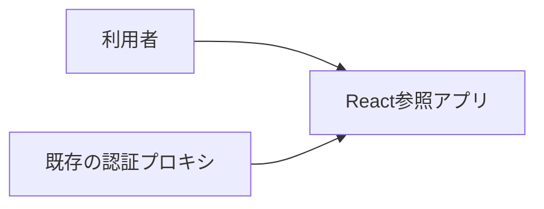
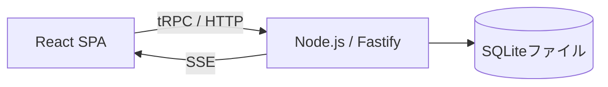
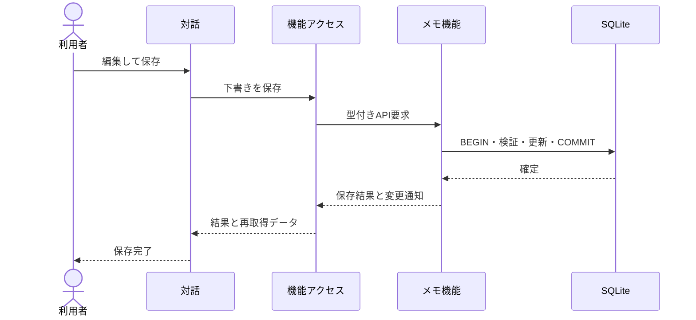
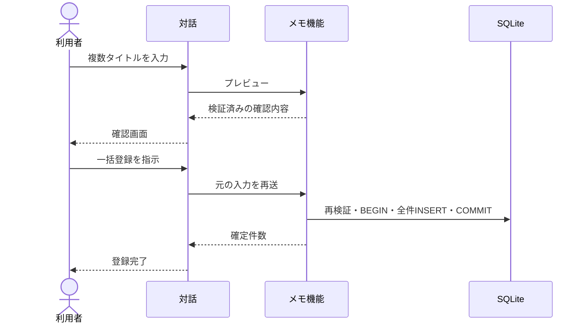
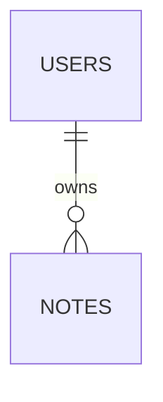

# アーキテクチャ

React 拡張参照アプリの構成、実現パターン、設計上の制約、テーブル設計を記録します。共通の依存方向は [React補足](architecture-react.md)、ユースケース仕様は [UC一覧](project.md#usecases) を参照します。

## 1. システムコンテキスト

## 2. コンテナ

| コンテナ | 技術 | 責務 | リポジトリ内パス |
| --- | --- | --- | --- |
| 画面 | React / TanStack / Mantine | ユースケースの対話 | frontend/src |
| サーバー | Node.js / Fastify / tRPC | 認証境界、機能、結果確定 | backend |
| 永続化 | SQLite / node:sqlite | 所有者別データと制約 | backend/db、backend/features/notes |

UI→API の差し替え境界は Vite の `@notes-access` 参照先1箇所です。本配布では実処理へ接続しており、モックは必要時のみ作成します。

## 3. 実現パターン

### UCP-1. 取得・編集・確定

適用: 取得データを下書きとして編集し、保存・削除する。

| 役割 | 責務 | 実装パス |
| --- | --- | --- |
| 対話 | 入力、下書き、失敗時の再入力 | frontend/src/usecases/edit-notes/EditNotes.tsx |
| 機能アクセス | Query、mutation、変更通知の購読 | frontend/src/features/notes/queries.ts |
| API境界 | 入力形式・利用者・公開エラーの検証 | backend/http/router.ts |
| メモ機能 | 所有者条件、版検査、SQL確定 | backend/features/notes/service.ts |

状態更新主体および結果確定点はメモ機能の COMMIT です。失敗時は ROLLBACK して下書きを維持します（再取得や SSE の失敗で確定済み保存を失敗扱いに変更しません）。

### UCP-2. 入力・確認・一括確定

適用: 複数画面の対話で内容を確認後、関連更新を一体で確定する。

| 役割 | 責務 | 実装パス |
| --- | --- | --- |
| 対話の親 | 段階をまたぐ入力の保持 | frontend/src/usecases/import-notes/ImportDialogue.tsx |
| 入力・確認 | プレビューと最終実行 | frontend/src/usecases/import-notes/ImportInput.tsx、ImportConfirm.tsx |
| 共通のメモ機能 | 検証と一括INSERT | backend/features/notes/service.ts |

確認待ちはトランザクション外で行います。既存タイトル衝突等で途中失敗した場合は全件ロールバックします。

## 4. 設計上の制約

- E2E の分離条件と同一 DB の競合境界は [第6節](#test-boundary) に定義します。

## 5. テーブル設計

DB は `DB_PATH` で指定し、本番・E2E とも同一マイグレーションを使用します。

| テーブル | カラム | 制約 |
| --- | --- | --- |
| users | id TEXT、name TEXT | id主キー、全項目NOT NULL |
| notes | id TEXT、owner_id TEXT、title TEXT、body TEXT、version INTEGER、updated_at TEXT | id主キー、owner_id外部キー、owner_id/title一意、全項目NOT NULL |

title は1〜100文字、body は10,000文字以内、version は正整数、日時は UTC ISO 文字列（これらはサンプルの仕様であり全製品の制約ではありません）。同一所有者の複数タブ編集を検証するため、本サンプルの notes のみ version による版検査を行います。

## 6. テスト分離と検証境界

`tests/e2e/fixtures.ts` が一時領域を確保し、ビルド済み `backend/main` を `DB_PATH`・`PORT=0` で起動します。ready 受信後に Playwright の baseURL を設定し、終了時にプロセス停止と一時領域削除を行います。全 worker は同一ビルド成果物を使用しますが、各テストはブラウザ Context、本番 Node プロセス、OS 自動割当ポート、一時 SQLite ファイル、Cookie、セッション、SSE 購読を分離します。マイグレーションと業務処理は本番と同じコードを実行し、UI 操作後は独立した読取専用 DB 接続でコミット済みデータを確認します。fixture は成否を問わずサーバー停止、接続解放、一時領域削除を行います。共有 DB の全削除、テスト用リセット API、外側トランザクションは使用しません。同一 DB の競合は1テスト内で複数 Page/Context を作成して検証します。
