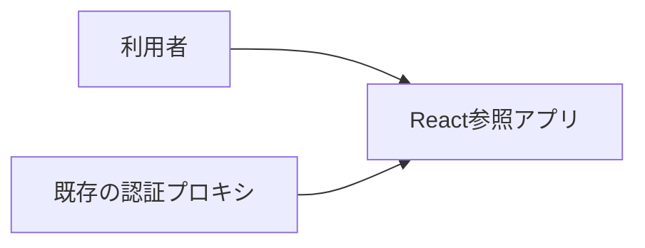
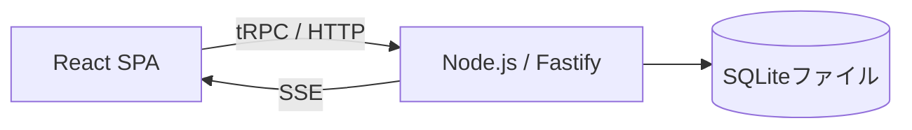

# アーキテクチャ

React 拡張参照アプリの全体構成、実現パターンの適用条件、設計上の制約を記録します。React・Node.js の共通構造は [React補足](architecture-react.md)、ユースケース仕様は [UC一覧](project.md#usecases)、具体的なパターンとデータ設計は `design/` を参照します。

## 1. システムコンテキスト

## 2. コンテナ

| コンテナ | 技術 | 責務 | リポジトリ内パス |
| --- | --- | --- | --- |
| 画面 | React / TanStack / Mantine | ユースケースの対話 | frontend/src |
| サーバー | Node.js / Fastify / tRPC | 認証境界、機能、結果確定 | backend |
| 永続化 | SQLite / node:sqlite | 所有者別データと制約 | backend/db、backend/features/notes |

UI→API の差し替え境界は Vite の `@notes-access` 参照先1箇所です。本配布では実処理へ接続しており、モックは必要な期間のみ作成します。

## 3. 実現パターンの適用条件

| 設計 | 適用条件 | 関与コンテナ |
| --- | --- | --- |
| [UCP-1. 取得・編集・確定](design/UCP-1.md) | 取得データを下書きとして編集し、保存・削除する。 | 画面・サーバー・永続化 |
| [UCP-2. 入力・確認・一括確定](design/UCP-2.md) | 複数画面の対話で内容を確認後、関連更新を一体で確定する。 | 画面・サーバー・永続化 |

## 4. 設計上の制約

- 保存方式、テーブル、値の制約は [データ設計](design/data.md) に従います。
- React・Node.js の責務、状態更新、起動単位は [React補足](architecture-react.md) に従います。
- E2E の分離条件と同一 DB の競合境界は [並列E2E](architecture-react.md#test-boundary) に従います。
- 共有環境の認証境界は [配備・認証](architecture-react.md#deployment) に従います。
