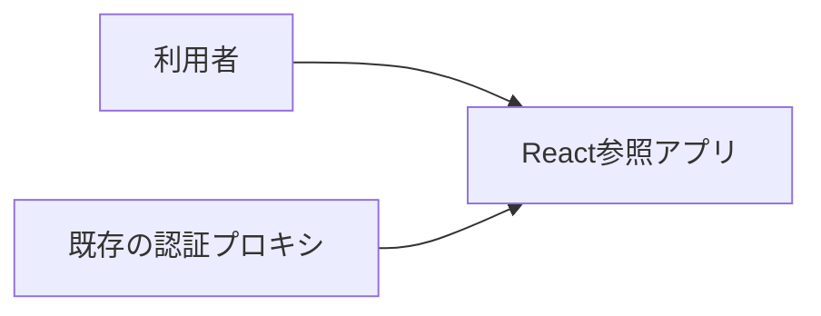
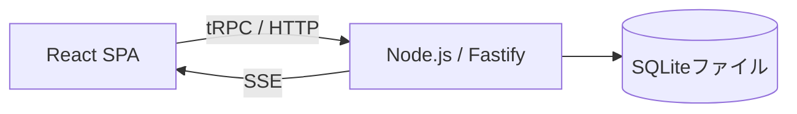

# アーキテクチャ

React 拡張参照アプリの構成、共通方針、重要な設計判断を記録します。共通の依存方向は [React補足](architecture-react.md)、ユースケース仕様は [UC一覧](project.md#usecases) を参照します。

## 全体設計の合意

責務分担と SQLite の採用は合意済みです。サンプルの具象 UI と E2E 結果は利用者受け入れ確認前であり、架空のコミットや応答を合意記録に補いません。

## 1. システムコンテキスト

## 2. コンテナ

| コンテナ | 技術 | 責務 | リポジトリ内パス |
| --- | --- | --- | --- |
| 画面 | React / TanStack / Mantine | ユースケースの対話 | frontend/src |
| サーバー | Node.js / Fastify / tRPC | 認証境界、機能、結果確定 | backend |
| 永続化 | SQLite / node:sqlite | 所有者別データと制約 | backend/db、backend/features/notes |

UI→API の差し替え境界は Vite の `@notes-access` 参照先1箇所です。本配布では実処理へ接続しており、モックは必要時のみ作成します。

## 3. 実現パターンの適用条件

| 設計 | 適用条件 | 関与コンテナ |
| --- | --- | --- |
| [UCP-1. 取得・編集・確定](design/UCP-1.md) | 取得データを下書きとして編集し、保存・削除する。 | 画面・サーバー・永続化 |
| [UCP-2. 入力・確認・一括確定](design/UCP-2.md) | 複数画面の対話で内容を確認後、関連更新を一体で確定する。 | 画面・サーバー・永続化 |

永続化の具体的な定義・制約は [データ設計](design/data.md) を参照します。

## 4. 設計判断

| ID | 決定 | 根拠と出所 | 影響するユースケース |
| --- | --- | --- | --- |
| ADR-1 | Reactは対話、Node.jsは機能 | 利用者合意に基づく責務分割 | UC-1、UC-2 |
| ADR-2 | SQLiteを既定とする | 利用者の「特別指定しない場合はSQLite」方針 | UC-1、UC-2 |
| ADR-3 | test-scopeで本番サーバーとDBを分離 | UI→DB並列E2E要件（同一DBクリアでは干渉防止不可） | UC-1、UC-2 |
| ADR-4 | factoryで依存注入しreset APIを設けない | 共有DBを避け、テスト専用契約を製品へ持ち込まない | 全体 |
| ADR-5 | node:sqliteを採用、ORMなし | ネイティブ依存を削減。Node版を固定して運用 | 永続化 |

## 5. テスト分離と検証境界

`tests/e2e/fixtures.ts` が一時領域を確保し、ビルド済み `backend/main` を `DB_PATH`・`PORT=0` で起動します。ready 受信後に Playwright の baseURL を設定し、終了時にプロセス停止と一時領域削除を行います。

全 worker は同一ビルド成果物を使用しますが、DB・Cookie・セッション・SSE 購読は完全に分離されます。同一 DB 競合は1テスト内で複数 Page を作成して検証します。
