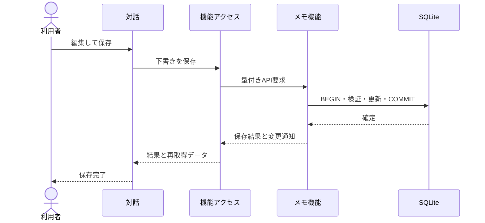

# UCP-1. 取得・編集・確定

関連: [アーキテクチャ](../architecture.md)、[ユースケース](../usecases/UC-1.md)、[データ設計](data.md)。

適用: 取得データを下書きとして編集し、保存・削除する。

| 役割 | 責務 | 実装パス |
| --- | --- | --- |
| 対話 | 入力、下書き、失敗時の再入力 | frontend/src/usecases/edit-notes/EditNotes.tsx |
| 機能アクセス | Query、mutation、変更通知の購読 | frontend/src/features/notes/queries.ts |
| API境界 | 入力形式・利用者・公開エラーの検証 | backend/http/router.ts |
| メモ機能 | 所有者条件、版検査、SQL確定 | backend/features/notes/service.ts |

状態更新主体および結果確定点はメモ機能の COMMIT です。失敗時は ROLLBACK して下書きを維持します。再取得や SSE の失敗で確定済み保存を失敗扱いに変更しません。

モック境界と合成点は [アーキテクチャ](../architecture.md) の UI→API の定義に従います。UC-1 固有の逸脱はありません。
