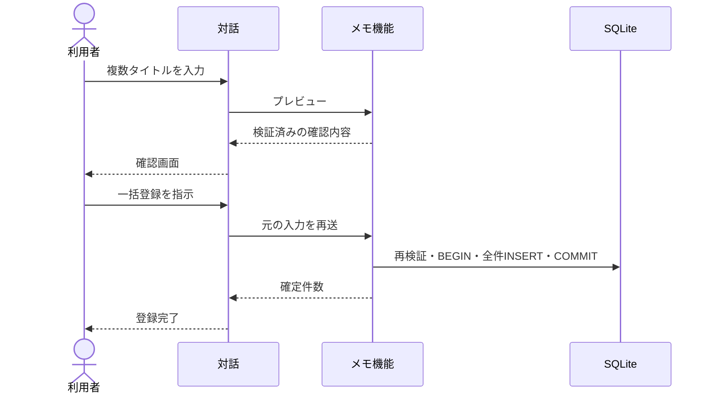

# UCP-2. 入力・確認・一括確定

関連: [アーキテクチャ](../architecture.md)、[ユースケース](../usecases/複数のメモを確認して一括登録する/README.md)、[データ設計](data.md)。

適用: 複数画面の対話で内容を確認後、関連更新を一体で確定する。

| 役割 | 責務 | 実装パス |
| --- | --- | --- |
| 対話の親 | 段階をまたぐ入力の保持 | frontend/src/usecases/import-notes/ImportDialogue.tsx |
| 入力・確認 | プレビューと最終実行 | frontend/src/usecases/import-notes/ImportInput.tsx、ImportConfirm.tsx |
| 共通のメモ機能 | 検証と一括INSERT | backend/features/notes/service.ts |

確認待ちはトランザクション外で行います。既存タイトル衝突等で途中失敗した場合は全件ロールバックします。

モック境界と合成点は [アーキテクチャ](../architecture.md) の UI→API の定義に従います。「複数のメモを確認して一括登録する」 固有の件数上限は [プロジェクト定義の制約](../project.md#constraints) を参照します。
