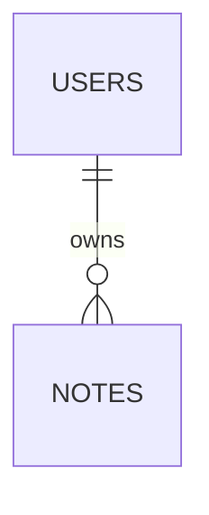

# データ設計

関連: [アーキテクチャ](../architecture.md)、[UCP-1](UCP-1.md)、[UCP-2](UCP-2.md)。

DB は `DB_PATH` で指定し、本番・E2E とも同一マイグレーションを使用します。

| テーブル | カラム | 制約 |
| --- | --- | --- |
| users | id TEXT、name TEXT | id主キー、全項目NOT NULL |
| notes | id TEXT、owner_id TEXT、title TEXT、body TEXT、version INTEGER、updated_at TEXT | id主キー、owner_id外部キー、owner_id/title一意、全項目NOT NULL |

title は1〜100文字、body は10,000文字以内、version は正整数、日時は UTC ISO 文字列（これらはサンプルの仕様であり全製品の制約ではありません）。同一所有者の複数タブ編集を検証するため、本サンプルの notes のみ version による版検査を行います。

テーブル設計の合意状態: 参照実装の範囲で提示（採用先プロダクトの合意として自動転用しません）。
