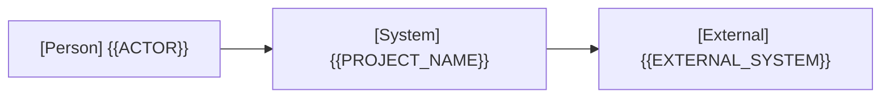

# アーキテクチャ

全体構造、共通方針、重要な設計判断と全体設計の合意の正本です。具体的な処理は実現パターンの設計、保存形式は [データ設計](design/data.md)、仕様は [ユースケース一覧](project.md#usecases) から参照します。

## 全体設計の合意

- 提示コミット: {{COMMIT_HASH}}
- 対象節: {{AGREED_SECTIONS}}
- 応答の原文:
  > {{USER_RESPONSE}}

全体設計の合意が記録されるまで段階4（実処理接続）へ進めません。テーブルの追加・変更時は [データ設計](design/data.md#agreement) の合意も必要です。

## 1. システムコンテキスト

外部の人物・システムと本システムの関係を1枚で示します（Person には主アクター名を指定）。

## 2. コンテナ

| コンテナ | 技術 | 責務 | リポジトリ内パス |
| --- | --- | --- | --- |
| {{CONTAINER}} | {{TECH}} | {{RESPONSIBILITY}} | {{PATH}} |

全体の依存方向、状態の所有者と永続化の共通方針を記し、関係線ごとにモック切り替え境界（合成点）の有無を記載します。単一コンテナ構成の場合は図を省略し、1文の記述で代替可能です。

## 3. 実現パターン

| 実現パターンの設計 | 適用条件・関与コンテナ |
| --- | --- |
| [UCP-1](design/UCP-1.md) | {{APPLICABILITY}} |

## 4. 設計判断

| ID | 決定 | 根拠とした事実と出所 | 影響するユースケース |
| --- | --- | --- | --- |

ID は `ADR-1` から順に付与します（本表への1行記録を基本とし、詳細な [ADR 文書](standards/design-and-documentation.md#completion) は要件を満たす場合のみ同 ID で作成）。出所には外部ドキュメントの URL、実行コマンドと結果、または利用者の応答原文を明記します。出所を特定できない事項は決定として記録せず、利用者に確認します。実装破棄時も決定内容は保持します。
