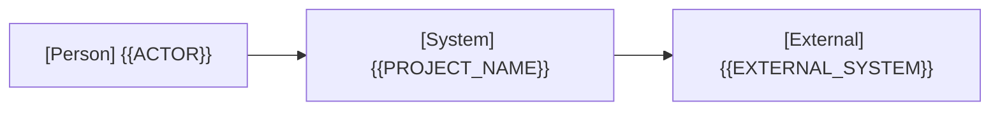
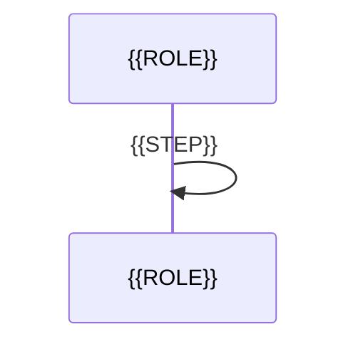
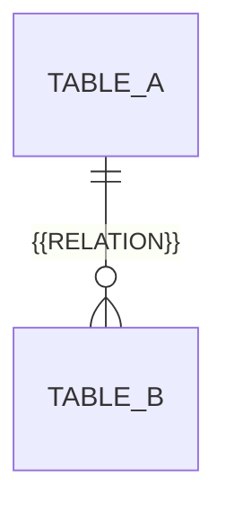

# アーキテクチャ

全体構造、実現パターン、設計上の制約、およびDBテーブル設計の正本です。ユースケース固有の仕様は [ユースケース一覧](project.md#usecases) から対象の本文を参照します。図は Mermaid で記述し、コード図は作成しません。

## 1. システムコンテキスト

外部の人物・システムと本システムの関係を1枚で示します（Person には主アクター名を指定）。

## 2. コンテナ

| コンテナ | 技術 | 責務 | リポジトリ内パス |
| --- | --- | --- | --- |
| {{CONTAINER}} | {{TECH}} | {{RESPONSIBILITY}} | {{PATH}} |

関係線ごとにモック切り替え境界（合成点）の有無を記載します。単一コンテナ構成の場合は図を省略し、1文の記述で代替可能です。

## 3. 実現パターン

ユースケースの実現パターンの型を `UCP-1` から順に定義します。既存パターンで説明できないユースケースが生じた場合のみ、[仕組みの追加基準](standards/design-and-documentation.md#design-decisions) を満たして新設します（シーケンス図は1パターンにつき1本）。

### UCP-1. {{PATTERN_NAME}}

- 適用条件と関与コンテナ: {{APPLICABILITY}}
- 役割表（実装パスは段階4完了時に記入）:

| 役割 | 責務 | 実装パス |
| --- | --- | --- |
| {{ROLE}} | {{ROLE_RESPONSIBILITY}} | |

- 主成功系列（参加者名は役割名）:

- 整合性: 状態更新の主体 {{OWNER}} / 結果確定点 {{COMMIT_POINT}} / 障害時の停止・継続 {{FAILURE_BEHAVIOR}} / 境界（競合や通信断が想定される場合のみ） {{BOUNDARY}}
- モックに置き換える境界と合成点: {{MOCK_BOUNDARY}}

## 4. 設計上の制約

{{ARCHITECTURAL_CONSTRAINTS}}

現在の設計が満たすべき制約と適用範囲を記述します。第1〜3節で表せる構成や責務は各節へ集約します。外部仕様に依存する場合は [確認した事実](project.md#design) を参照します。

## 5. テーブル設計

現在のDBテーブル設計を管理します。対象系列で追加・変更するテーブル設計のみを更新し、他文書へは転記しません。変更点と論点は [設計標準](standards/design-and-documentation.md#architecture-method) に従って会話で提示します。DBを使わない場合はその旨を記し、以下の記入欄を削除します。

| テーブル | 責務 | カラム（型 / NULL可否） | 主キー・外部キー・一意制約 |
| --- | --- | --- | --- |
| {{TABLE}} | {{RESPONSIBILITY}} | {{COLUMN}} / {{TYPE}} / {{NULLABLE}} | {{CONSTRAINTS}} |
