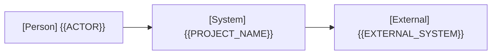
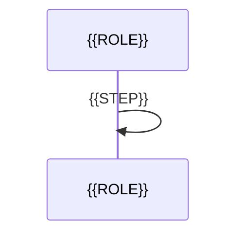

# アーキテクチャ

本書は全体構造、実現パターン、および設計判断の正本です。ユースケース固有の仕様は [プロジェクト定義](project.md#usecases) を参照してください。図は Mermaid で記述し、コード図は作成しません。

## 全体設計の合意

- 提示コミット: {{COMMIT_HASH}}
- 対象節: {{AGREED_SECTIONS}}
- 応答の原文:
  > {{USER_RESPONSE}}

この欄が埋まるまで、どのユースケースも段階4（実処理接続）に進めません。

## 1. システムコンテキスト

外部の人物・システムと本システムの関係を1枚で示します。Person にはユースケースの主アクター名を指定します。

## 2. コンテナ

| コンテナ | 技術 | 責務 | リポジトリ内パス |
| --- | --- | --- | --- |
| {{CONTAINER}} | {{TECH}} | {{RESPONSIBILITY}} | {{PATH}} |

関係線ごとに、モック切り替え境界（合成点）の有無を記載します。単一コンテナ構成の場合は図を省略し、1文の記述で代替できます。

## 3. 実現パターン

ユースケースの実現方法の型を `P-1` から順に定義します。既存パターンで説明できないユースケースが生じた場合のみ、[仕組みの追加基準](standards/design-and-documentation.md#design-decisions) の条件を満たして新設します（シーケンス図は1パターンにつき1本）。

### P-1. {{PATTERN_NAME}}

- 適用条件と関与コンテナ: {{APPLICABILITY}}
- 役割表（実装パスは段階4完了時に記入）:

| 役割 | 責務 | 実装パス |
| --- | --- | --- |
| {{ROLE}} | {{ROLE_RESPONSIBILITY}} | |

- 主成功系列（参加者名は役割名）:

- 整合性: 状態更新の主体 {{OWNER}} / 結果確定点 {{COMMIT_POINT}} / 障害時の停止・継続 {{FAILURE_BEHAVIOR}} / 境界（競合や通信断が想定される場合のみ） {{BOUNDARY}}
- モックに置き換える境界と合成点: {{MOCK_BOUNDARY}}
- 設計判断への参照: {{DECISION_IDS}}

## 4. 設計判断

| ID | 決定 | 根拠とした事実と出所 | 影響するユースケース |
| --- | --- | --- | --- |

出所には、外部ドキュメントの URL、実行コマンドと結果、または利用者の応答を明記します。出所を特定できない事項は決定とせず、[PLAN.md](../PLAN.md) の未決事項として管理します。実装を破棄した場合でも本節の決定は保持します。
