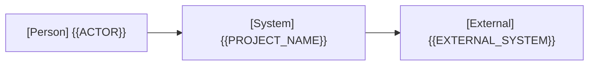
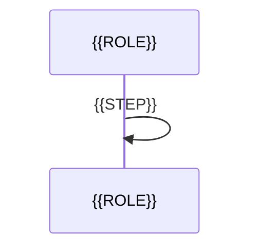

# アーキテクチャ

本書は全体構造、実現パターン、長期に保持する設計判断の正本です。ユースケースごとの仕様は [プロジェクト定義](project.md#usecases) を参照します。図は Mermaid で書き、コンポーネント図は必要なコンテナのみ、コード図は作りません。

## 全体設計の合意

- 提示コミット: {{COMMIT_HASH}}
- 対象節: {{AGREED_SECTIONS}}
- 応答の原文:
  > {{USER_RESPONSE}}

この欄が埋まるまで、どのユースケースも段階4（実処理接続）に入りません。

## 1. システムコンテキスト

外部の人・システムと本システムの関係を1枚で示します。Person はユースケースの主アクターと同じ名前にします。

## 2. コンテナ

| コンテナ | 技術 | 責務 | リポジトリ内パス |
| --- | --- | --- | --- |
| {{CONTAINER}} | {{TECH}} | {{RESPONSIBILITY}} | {{PATH}} |

関係線ごとに、モックへ切り替える境界（合成点）かどうかを記します。コンテナが1つの場合は図を省略し、1文で書けます。

## 3. 実現パターン

ユースケースの実現方法の型を P-1 から番号で定義します。ユースケースごとには作らず、既存パターンで説明できないユースケースが現れた時だけ、[仕組みの追加基準](standards/design-and-documentation.md#design-decisions) の4問に答えて追加します。シーケンス図はパターンごとに1本です。

### P-1. {{PATTERN_NAME}}

- 適用条件と関与コンテナ: {{APPLICABILITY}}
- 役割表（実装パスは段階4完了時に記入）:

| 役割 | 責務 | 実装パス |
| --- | --- | --- |
| {{ROLE}} | {{ROLE_RESPONSIBILITY}} | |

- 主成功系列（参加者名は役割名）:

- 整合性: 状態更新の主体 {{OWNER}} / 結果確定点 {{COMMIT_POINT}} / 障害時の停止・継続 {{FAILURE_BEHAVIOR}} / 境界（競合や通信断が想定される場合のみ） {{BOUNDARY}}
- モックに置き換える境界と合成点: {{MOCK_BOUNDARY}}
- 設計判断への参照: {{DECISION_IDS}}

## 4. 設計判断

| ID | 決定 | 根拠とした事実と出所 | 影響するユースケース |
| --- | --- | --- | --- |

出所は、外部文書の URL、実行したコマンドと結果、利用者の応答のいずれかを書きます。出所を書けない根拠は事実ではないので、決定にせず [PLAN.md](../PLAN.md) の未決事項として解消条件を書きます。実装を破棄しても本節は破棄しません。
