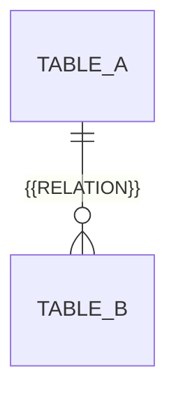

# データ設計

保存形式とその合意記録の正本です。DBを使う場合は以下にER図とテーブル定義を記載し、使わない場合はその旨と実際の保存形式を記し、不要な記入欄を削除します。

| テーブル | 責務 | カラム（型 / NULL可否） | 主キー・外部キー・一意制約 | 既存設計の変更点 |
| --- | --- | --- | --- | --- |
| {{TABLE}} | {{RESPONSIBILITY}} | {{COLUMN}} / {{TYPE}} / {{NULLABLE}} | {{CONSTRAINTS}} | {{CHANGE}} |

## テーブル設計の合意

対象系列の設計と合意は [設計標準](../standards/design-and-documentation.md#architecture-method) に従い、系列ごとに記録します。

- 系列 ID: {{SERIES_ID}} / 対象テーブルと変更範囲: {{TABLES_AND_SCOPE}}
- 提示コミット: {{COMMIT_HASH}} / 論点と回答: {{QUESTIONS_AND_ANSWERS}}
  > {{USER_RESPONSE}}
