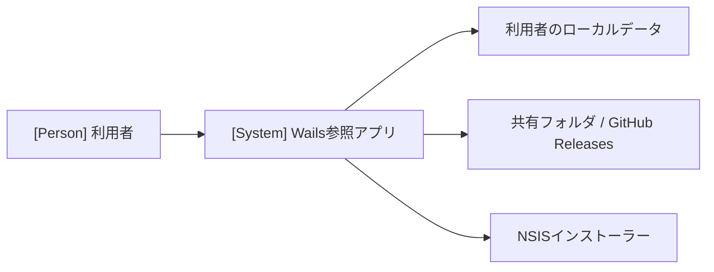
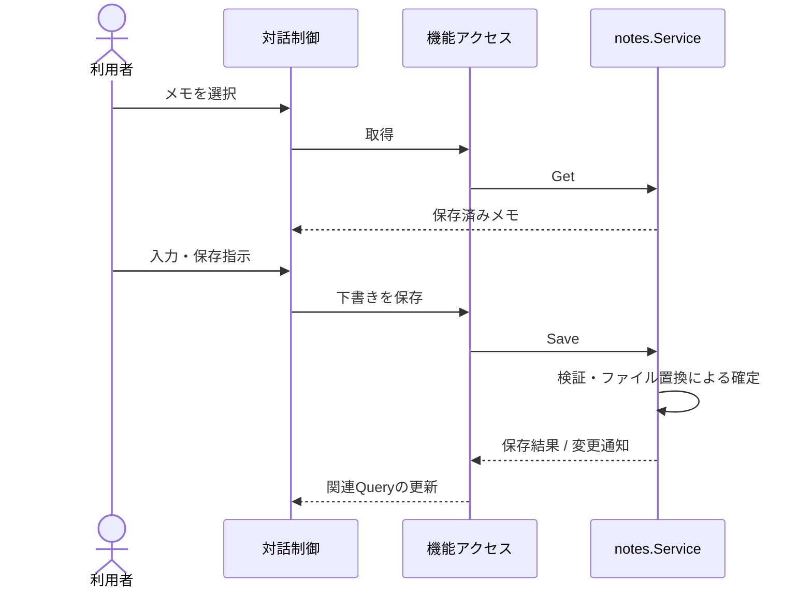
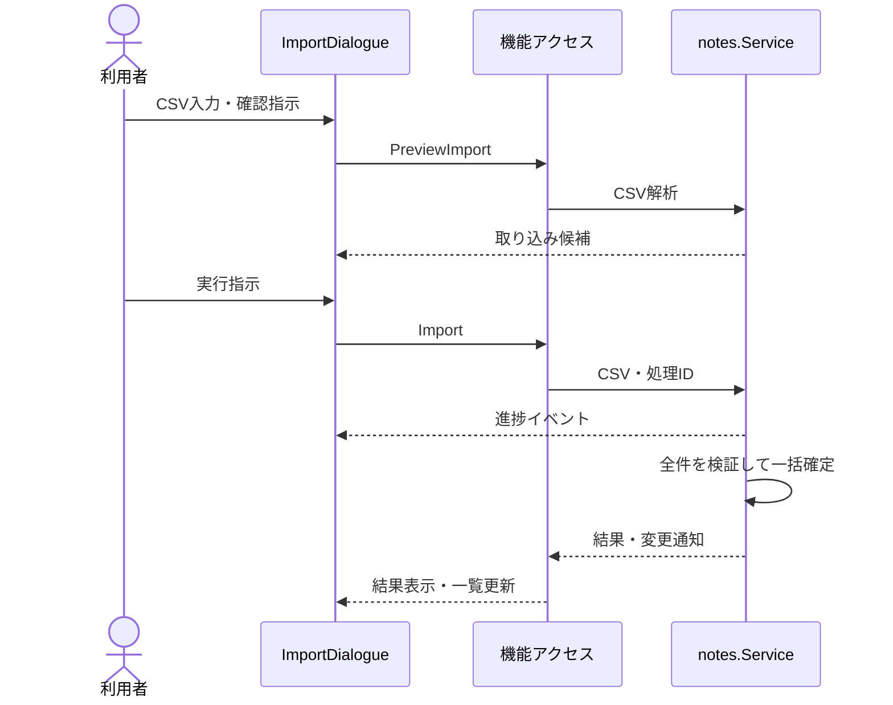

# アーキテクチャ

この参照アプリの構成と実現パターンを記す。Wails共通方針は [Wails補足](architecture-wails.md)、系列と受け入れ条件は [UC一覧](project.md#usecases)を参照する。

## 全体設計の合意

基本方針は作成依頼までの対話で合意済み。本配布物のサンプル実装・画面確認・実機検証は未完了である。提示コミットと利用者による実装の受け入れ応答は未記入とし、ソースの存在で代替しない。

## 1. システムコンテキスト

## 2. コンテナ

| 実行単位 | 技術・責務 | 配置 |
| --- | --- | --- |
| デスクトップアプリ | Goが業務機能・保存・起動終了を所有し、同じアプリ内のWebViewでReactが対話を実行 | `main.go`、`internal/`、`frontend/` |
| 更新インストーラー | Goの終了後、アプリファイルと登録情報を更新する外部プロセス | `build/windows/nsis/` |

検証時だけ同じGoサービスをWails server buildから利用する。独自REST APIや別のWebバックエンドは設けない。

起動は設定読込 → Logger・状態管理・機能Service生成 → Wails登録 → ウィンドウ作成 → 実行。終了はReactの確認 → Goの稼働処理確認 → 終了許可 → Service停止・Logger解放。編集中の画面を直接閉じず、WindowClosingとShouldQuitを同じ確認経路へ接続する。

## 3. 実現パターン

### UCP-1. 取得・編集・保存

UC-1に適用する。役割は `EditNotes/Editor`（下書き）、`features/notes/queries.ts`（取得・更新）、`notes.Service`（検証・保存）である。

Goのファイル置換成功を結果確定点とする。失敗時は既存データと下書きを保持する。取得結果の再取得で下書きを上書きしない。機能呼び出し境界のモック合成点は `frontend/vite.config.ts` の `@notes-service` である。

### UCP-2. 入力・確認・実行・結果確認

UC-2に適用する。`ImportDialogue`が複数ルート間の状態を所有し、`ImportInput`と`ImportConfirm`を切り替える。取得にはUC-1と同じ `listNotes` を使う。

確定前の失敗・中止では一部の行を保存しない。中止と確定の競合は、一覧の再取得で実状態を確認する。最後の進捗は `GetImportProgress` でも取得できる。モック合成点はUCP-1と同じである。

UC-3の更新も確認後に実行するが、NSIS起動後はプロセスを越えるため、インストーラーの成功をGoの戻り値で表さない。署名・ハッシュ検証失敗や起動失敗では現在のアプリを維持し、適用失敗はNSISが通知する。

## 4. 設計判断

| ID | 決定 | 根拠と出所 | 影響 |
| --- | --- | --- | --- |
| ADR-1 | 対話はFE、再利用可能な機能はGo。n:n対応 | 利用者との責務分割の合意。共通方針はWails補足 | 全UC |
| ADR-2 | サンプル保存はJSON一文書を置換する | 小規模でDB・ORMを必要としない。破損は停止し初期化しない | UC-1、UC-2 |
| ADR-3 | 更新適用はNSISへ集約 | Windows・未署名・アプリ内更新についての利用者合意 | UC-3 |

文書には実際の採用構成だけを記載する。製品へ採用した際の固有差分はここで管理する。

## 5. 保存設計

DBテーブルは使わない。`notes.json`は版番号1とメモ配列を持つ。項目は`id`・`title`・`body`・`updatedAt`。Goで読み込み、保存時は一時ファイルへの書込・同期後に置換する。WindowsはMoveFileExWの置換・書込完了指定を使用する。

通常ユーザーのアプリID別データ領域に保存する。インストール先・キャッシュ・ログとは分離する。バックアップ・クラウド同期・多プロセス編集は実装しない。
