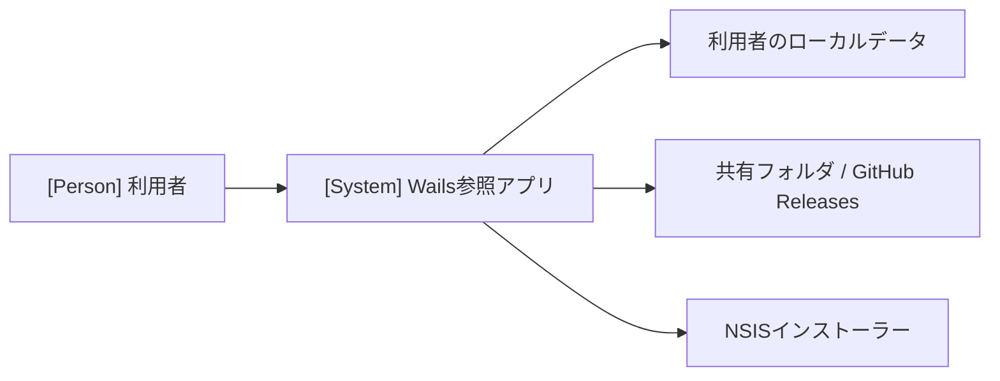
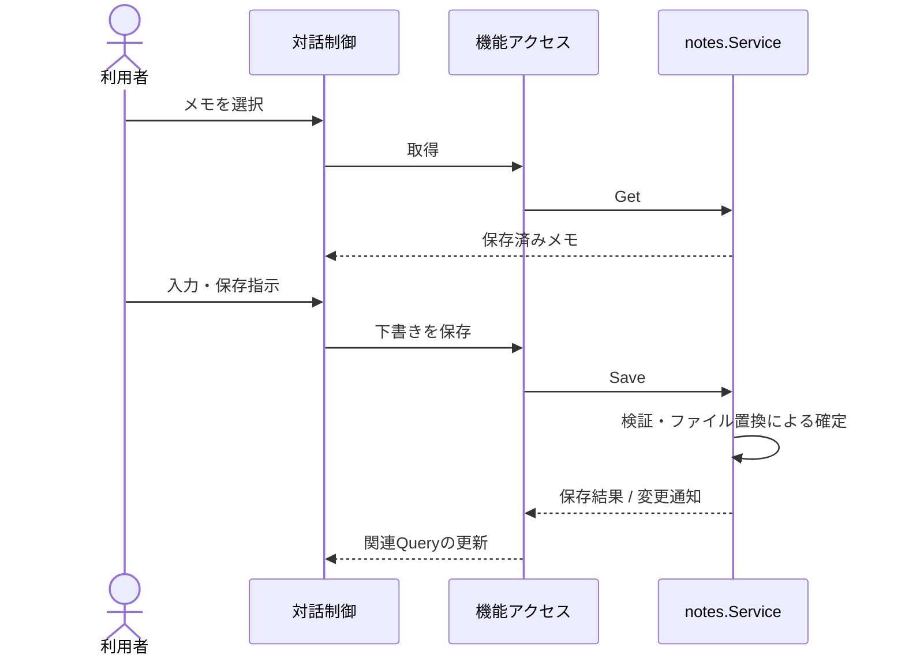
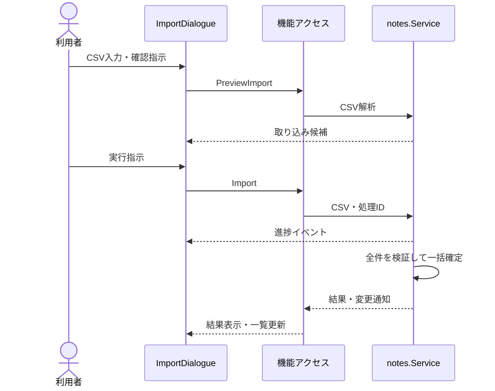
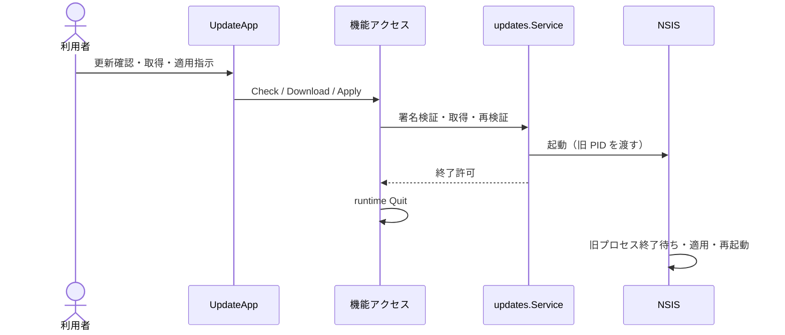

# アーキテクチャ

Wails 参照アプリの構成と実現パターンを記録します。Wails 共通方針は [Wails補足](architecture-wails.md)、系列と受け入れ条件は [UC一覧](project.md#usecases) を参照します。

## 全体設計の合意

基本方針は作成依頼までの対話で合意済みです。サンプル実装・具象 UI・画面確認・実機検証は未完了であり、提示コミットと利用者による実装の受け入れ応答は未記入とします。ソースの存在で合意を代替しません。

## 1. システムコンテキスト

## 2. コンテナ

| 実行単位 | 技術・責務 | 配置 |
| --- | --- | --- |
| デスクトップアプリ | Go が業務機能・保存・ライフサイクルを管理し、WebView 内の React が対話を実行 | `main.go`、`internal/`、`frontend/` |
| 更新インストーラー | Go 終了後にアプリファイルと登録情報を更新する外部プロセス | `build/windows/nsis/` |

検証時は同一 Go サービスを Wails server build から利用します（独自 REST API や別バックエンドは設けません）。

起動時は設定読込 → Logger・状態管理・機能 Service 生成 → Wails 登録 → ウィンドウ作成の順に行います。終了時は React の未保存確認 → Go の稼働処理確認・終了許可 → 応答受信後の runtime Application.Quit → Service 停止・Logger 解放の順に行います。Go は終了許可後の新規処理を拒否し、WindowClosing と ShouldQuit を同じ確認経路へ接続します。更新適用も、Go が NSIS 起動に成功して終了を許可した応答をフロントエンドが受け取ってから終了を要求します。

## 3. 実現パターン

### UCP-1. 取得・編集・保存

UC-1 に適用します。役割は `EditNotes/Editor`（下書き）、`features/notes/queries.ts`（取得・更新）、`notes.Service`（検証・保存）です。

Go のファイル置換成功を結果確定点とします。失敗時は既存データと下書きを保持し、取得結果の再取得で下書きを上書きしません。モック合成点は `frontend/vite.config.ts` の `@notes-service` です。

### UCP-2. 入力・確認・実行・結果確認

UC-2 に適用します。`ImportDialogue` が複数ルート間の状態を所有し、`ImportInput` と `ImportConfirm` を切り替えます。取得には UC-1 と同一の `listNotes` を使用します。

確定前の失敗や中止では一部行のみの保存は行いません。中止と確定の競合は、一覧の再取得で実状態を確認します。最後の進捗は `GetImportProgress` でも取得できます。モック合成点は UCP-1 と同様です。

### UCP-3. 検証・引き渡し・外部プロセスによる確定

UC-3 に適用します。UCP-2 と同じ「確認して実行する」対話ですが、結果はアプリ終了後に外部プロセス（NSIS）が確定する点が異なります。役割は `UpdateApp`（確認と適用指示）、`features/updates/queries.ts`（状態取得・進捗購読・終了要求）、`updates.Service`（署名・ハッシュ検証、取得、NSIS 起動）です。

結果確定点は NSIS のファイル置換であり、Go の戻り値は「NSIS 起動に成功し終了を許可した」ことだけを表します。署名・ハッシュ検証失敗や起動失敗では現在のアプリを維持し、適用失敗は NSIS が通知します。未保存確認は更新画面へ遷移する前に編集・取り込み画面の離脱ブロッカーが行います。モック合成点は設けず、server build では検証と取得までを確認します。

## 4. 設計判断

| ID | 決定 | 根拠と出所 | 影響 |
| --- | --- | --- | --- |
| ADR-1 | 対話はフロントエンド、再利用機能はGo（n:n対応） | 責務分離に関する利用者合意。共通方針はWails補足 | 全UC |
| ADR-2 | サンプルの保存は単一JSONファイルの置換とする | 小規模で DB・ORM 不要。破損時は停止し空初期化しない | UC-1、UC-2 |
| ADR-3 | 更新適用はNSISへ集約 | Windows・未署名アプリ内更新の利用者合意 | UC-3 |

文書には実際の採用構成だけを記載し、製品へ採用した際の固有差分はここで管理します。

## 5. 保存設計

DB テーブルは使用しません。`notes.json`（版番号1、メモ配列、項目: `id`・`title`・`body`・`updatedAt`）を Go で読み込み、一時ファイルへの書き込みと同期を経て置換します（Windows の `MoveFileExW` による置換・完了保証）。

保存先はユーザー領域（アプリ ID 別）とし、インストール先やキャッシュ・ログと分離します。バックアップ・クラウド同期・多プロセス編集は実装しません。
