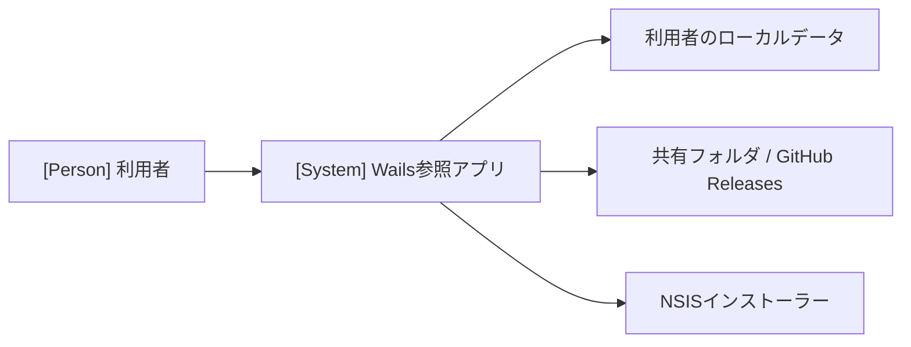

# アーキテクチャ

Wails 参照アプリの構成、実現パターン、設計上の制約、保存設計を記録します。Wails 共通方針は [Wails補足](architecture-wails.md)、系列と受け入れ条件は [UC一覧](project.md#usecases) を参照します。

## 1. システムコンテキスト

## 2. コンテナ

| 実行単位 | 技術・責務 | 配置 |
| --- | --- | --- |
| デスクトップアプリ | Go が業務機能・保存・ライフサイクルを管理し、WebView 内の React が対話を実行 | `main.go`、`internal/`、`frontend/` |
| 更新インストーラー | Go 終了後にアプリファイルと登録情報を更新する外部プロセス | `build/windows/nsis/` |

検証時は同一 Go サービスを Wails server build から利用します（独自 REST API や別バックエンドは設けません）。

起動時は設定読込 → Logger・状態管理・機能 Service 生成 → Wails 登録 → ウィンドウ作成の順に行います。終了時は React の未保存確認 → Go の稼働処理確認・終了許可 → 応答受信後の runtime Application.Quit → Service 停止・Logger 解放の順に行います。Go は終了許可後の新規処理を拒否し、WindowClosing と ShouldQuit を同じ確認経路へ接続します。更新適用も、Go が NSIS 起動に成功して終了を許可した応答をフロントエンドが受け取ってから終了を要求します。

## 3. 実現パターンの適用条件

| 設計 | 適用条件 | 関与コンテナ |
| --- | --- | --- |
| [UCP-1. 取得・編集・保存](design/UCP-1.md) | 取得データを下書きとして編集して保存する（UC-1）。 | デスクトップアプリ |
| [UCP-2. 入力・確認・実行・結果確認](design/UCP-2.md) | 複数画面で入力を確認し、一括処理の結果を確認する（UC-2）。 | デスクトップアプリ |
| [UCP-3. 検証・引き渡し・外部プロセスによる確定](design/UCP-3.md) | 検証済み更新を外部プロセスへ引き渡し、アプリ終了後に確定する（UC-3）。 | デスクトップアプリ・更新インストーラー |

永続化の具体的な定義・制約は [データ設計](design/data.md) を参照します。

## 4. 設計上の制約

- 本番 UI は同梱アセットを使用し、外部コンテンツにアプリの権限を与えません。

## 5. 保存設計

データベーステーブルや ORM は使用しません。保存方式とデータ定義は [データ設計](design/data.md) に集約します。
