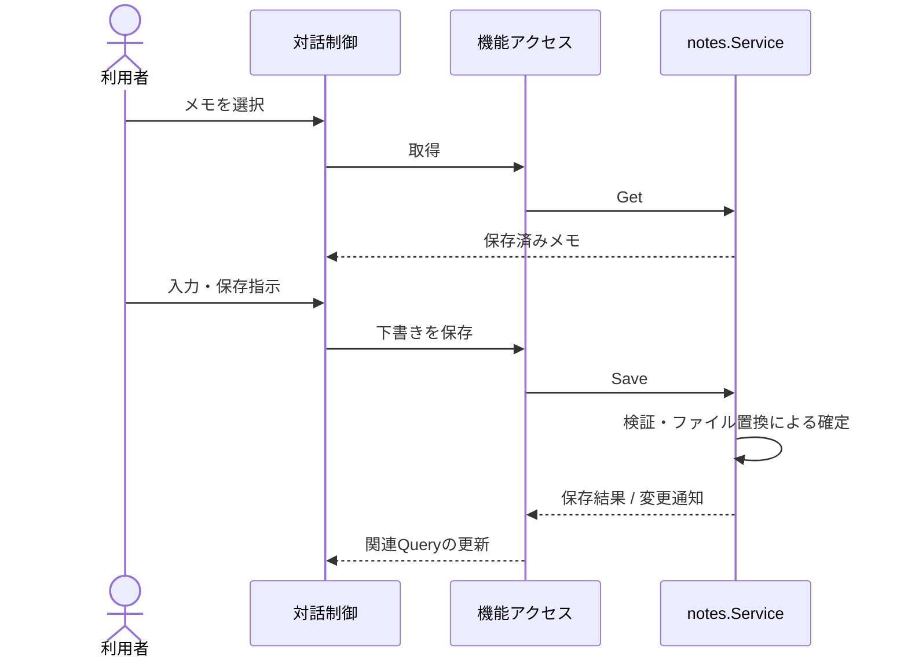

# UCP-1. 取得・編集・保存

関連: [アーキテクチャ](../architecture.md)、[ユースケース](../usecases/メモを作成・編集して保存する/README.md)、[データ設計](data.md)。

「メモを作成・編集して保存する」 に適用します。役割は `EditNotes/Editor`（下書き）、`features/notes/queries.ts`（取得・更新）、`notes.Service`（検証・保存）です。

Go のファイル置換成功を結果確定点とします。失敗時は既存データと下書きを保持し、取得結果の再取得で下書きを上書きしません。モック合成点は `frontend/vite.config.ts` の `@notes-service` です。

UC 固有の逸脱: 「メモを作成・編集して保存する」 はなし。
