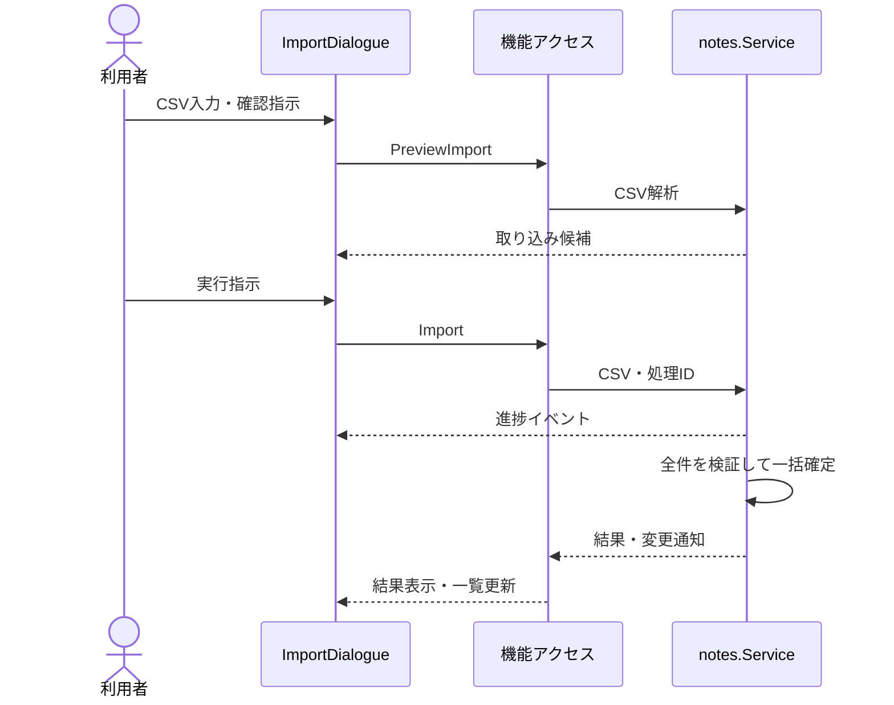

# UCP-2. 入力・確認・実行・結果確認

関連: [アーキテクチャ](../architecture.md)、[ユースケース](../usecases/UC-2.md)、[データ設計](data.md)。

UC-2 に適用します。`ImportDialogue` が複数ルート間の状態を所有し、`ImportInput` と `ImportConfirm` を切り替えます。取得には UC-1 と同一の `listNotes` を使用します。

確定前の失敗や中止では一部行のみの保存は行いません。中止と確定の競合は、一覧の再取得で実状態を確認します。最後の進捗は `GetImportProgress` でも取得できます。モック合成点は [UCP-1](UCP-1.md) と同様です。

UC 固有の逸脱: UC-2 はなし。
