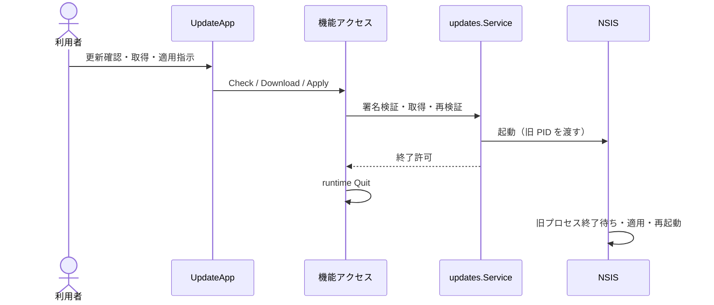

# UCP-3. 検証・引き渡し・外部プロセスによる確定

関連: [アーキテクチャ](../architecture.md)、[ユースケース](../usecases/UC-3.md)。

UC-3 に適用します。[UCP-2](UCP-2.md) と同じ「確認して実行する」対話ですが、結果はアプリ終了後に外部プロセス（NSIS）が確定する点が異なります。役割は `UpdateApp`（確認と適用指示）、`features/updates/queries.ts`（状態取得・進捗購読・終了要求）、`updates.Service`（署名・ハッシュ検証、取得、NSIS 起動）です。

結果確定点は NSIS のファイル置換であり、Go の戻り値は「NSIS 起動に成功し終了を許可した」ことだけを表します。署名・ハッシュ検証失敗や起動失敗では現在のアプリを維持し、適用失敗は NSIS が通知します。未保存確認は更新画面へ遷移する前に編集・取り込み画面の離脱ブロッカーが行います。モック合成点は設けず、server build では検証と取得までを確認します。

UC 固有の逸脱: UC-3 はなし。
