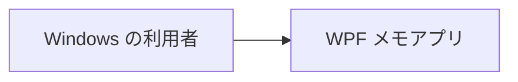
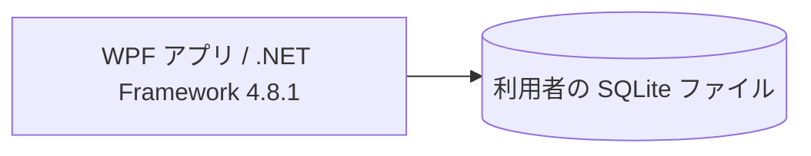

# アーキテクチャ

WPF 参照アプリの全体構造を示します。技術固有の責務は [WPF 補足](architecture-wpf.md)、利用者の振る舞いは [ユースケース一覧](project.md#usecases)、保存条件は [データ設計](design/data.md) を正本とします。

## 1. システムコンテキスト

## 2. コンテナ

画面と Model は単一の WPF 実行ファイル内でプロセス内の機能呼出しを行います。内部の責務は以下の領域で分けます。

| 領域 | 責務 | 実装パス |
| --- | --- | --- |
| 画面 | 入力・選択・表示、通常ウィンドウと対話ダイアログ | `app/View/` |
| 対話 | 下書き、確認、実行中・失敗時状態、画面遷移 | `app/ViewModel/` |
| Model | ユースケースの組合せ、機能処理、値の規則、保存 | `app/Model/` |
| 起動 | 設定・インスタンス判定・DI の組み立て | `app/` |

## 3. 実現パターンの適用条件

| 設計 | 適用条件 | 関与領域 |
| --- | --- | --- |
| [UCP-1. 取得・編集・確定](design/UCP-1.md) | 一覧から対象を選び、下書きを編集して保存・削除する | View・ViewModel・Model・SQLite |
| [UCP-2. 入力・確認・一括確定](design/UCP-2.md) | 複数件を確認後、再検証して一体で確定する | View・ViewModel・Model・SQLite |

## 4. 設計上の制約

- フォルダーは `View/`・`ViewModel/`・`Model/` を最上位とし、Model の下に `UseCase/`・`Domain/`・`Infrastructure/` を置きます。`Domain/Notes/` がメモの型・規則・契約、`Infrastructure/Sqlite/Notes/` がメモの SQLite 実装を担当します。Infrastructure は技術別、その下を業務領域別に分けます。
- View / ViewModel とユースケースを 1 対 1 に対応させません。Model の UseCase が必要な機能を組み合わせます。
- 永続化とトランザクションは Model が所有します。UI は COMMIT 成功を保存成功として扱い、後続の表示取得の失敗と分けます。
- 単一インスタンス・通常 1 ウィンドウ・画面遷移・未保存確認・モックの合成点は [WPF 固有設計](architecture-wpf.md) に従います。
- データ領域・値・版・SQL 移行は [データ設計](design/data.md)、自動テストの分離は [テスト境界](architecture-wpf.md#test-boundary) に従います。
