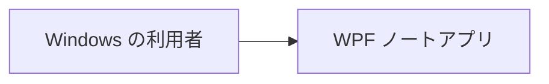
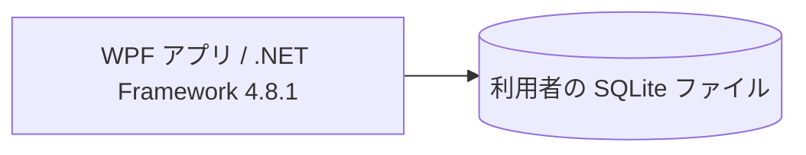

# アーキテクチャ

WPF 参照アプリの全体構造を示します。技術固有の責務は [WPF 補足](architecture-wpf.md)、利用者の振る舞いは [ユースケース一覧](project.md#usecases)、保存条件は [データ設計](design/data.md) を正本とします。

## 1. システムコンテキスト

## 2. コンテナ

画面、Domain、Infrastructure は単一の WPF 実行ファイル内でプロセス内の機能呼出しを行います。

| 領域 | 責務 | 実装パス |
| --- | --- | --- |
| 画面 | ウィンドウ枠、一覧・詳細・編集の表示、入力、確認ダイアログ | `app/View/` |
| 対話 | 下書き、実行中・失敗時状態、画面遷移 | `app/ViewModel/` |
| Domain | 不変な値、規則、サービスの契約 | `app/Domain/` |
| Infrastructure | 取得・保存・削除の実装、永続化 | `app/Infrastructure/` |
| 起動 | 設定・インスタンス判定・DI の組み立て | `app/` |

## 3. 実現パターンの適用条件

| 設計 | 適用条件 | 関与領域 |
| --- | --- | --- |
| [UCP-1. 取得・単票確定](design/UCP-1.md) | 一覧・詳細の取得と、ノートの追加・更新・削除 | View・ViewModel・Domain・Infrastructure・SQLite |

## 4. 設計上の制約

- `View/`・`ViewModel/`・`Domain/`・`Infrastructure/` を `app/` 直下に置き、`Domain/Notes/` がノートの型・規則・契約、`Infrastructure/Sqlite/Notes/` が SQLite 実装を担当します。Mock 専用の実装は `Infrastructure/InMemory/Notes/` に置きます。Infrastructure は技術別、その下を業務領域別に分けます。
- View / ViewModel とユースケースを 1 対 1 に対応させません。今回は機能の組合せが不要なので、ViewModel が Domain の `INotesService` を直接利用します。
- 4 領域の依存方向と、状態の保持先・Domain の不変な値・純粋関数の基準は [状態の分担と Domain](architecture-wpf.md#state-domain) に従います。自動検査の対象範囲は [層の依存検査](architecture-wpf.md#layer-analysis) を参照します。
- 永続化とトランザクションは Infrastructure が所有します。UI は COMMIT 成功を保存成功として扱い、後続の表示取得の失敗と分けます。
- 単一インスタンス・通常 1 ウィンドウ・画面遷移・未保存確認・モックの合成点は [WPF 固有設計](architecture-wpf.md) に従います。
- データ領域・値・版・SQL 移行は [データ設計](design/data.md)、自動テストの分離は [テスト境界](architecture-wpf.md#test-boundary) に従います。
