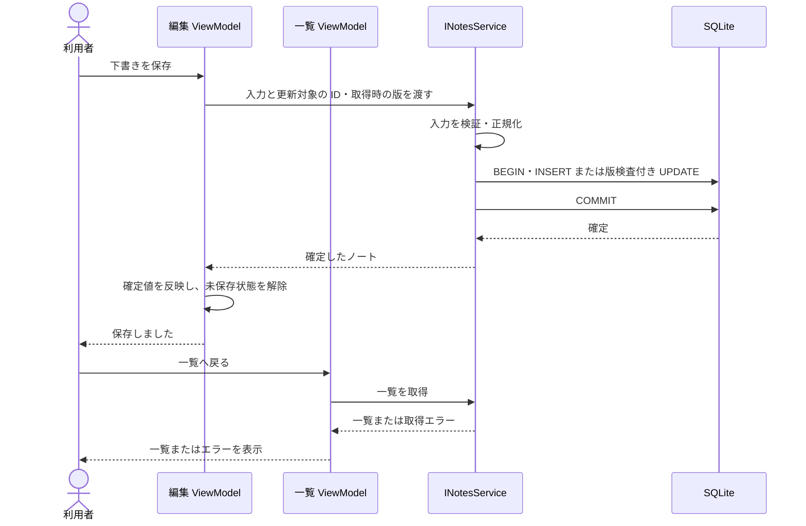

# UCP-1. 取得・単票確定

関連: [アーキテクチャ](../architecture.md)、[データ設計](data.md)。

適用: [ノート一覧の表示](../usecases/ノート一覧の表示/README.md)、[ノート詳細の表示](../usecases/ノート詳細の表示/README.md)、[ノートの追加](../usecases/ノートの追加/README.md)、[ノートの更新](../usecases/ノートの更新/README.md)、[ノートの削除](../usecases/ノートの削除/README.md)。

| 役割 | 責務 | 実装パス |
| --- | --- | --- |
| 一覧の対話 | 一覧取得、項目からの詳細表示、取得エラー | `app/ViewModel/NoteListViewModel.cs` |
| 詳細の対話 | ID による最新取得、対象なし・取得エラー、編集への移動、削除確認・削除エラー | `app/ViewModel/NoteDetailsViewModel.cs` |
| 編集の対話 | 追加・更新の下書き、入力エラー、未保存確認、保存結果 | `app/ViewModel/NoteEditViewModel.cs` |
| 画面 | 一覧・詳細・編集の表示と Binding | `app/View/NoteListView.xaml`、`NoteDetailsView.xaml`、`NoteEditView.xaml` |
| 確認の依頼 | 削除・未保存の破棄の確認を求め、承認の有無を返す | `app/ViewModel/IDialogService.cs` |
| 確認の表示 | basic dialog 形式の確認ダイアログと親ウィンドウの scrim | `app/View/DialogService.cs`、`ConfirmDialog.xaml` |
| 機能の境界 | 一覧・詳細取得、保存、削除の入出力 | `app/Domain/Notes/INotesService.cs` |
| 入出力の値 | 不変な positional record の `Note`・`NoteInput` | `app/Domain/Notes/Note.cs`、`NoteInput.cs` |
| 値の規則 | タイトル・本文の検証と正規化 | `app/Domain/Notes/NoteRules.cs` |
| 実処理 | 最新取得、版検査、SQL、保存確定 | `app/Infrastructure/Sqlite/Notes/NotesService.cs` |
| モック | Mock 構成でのノートの保持 | `app/Infrastructure/InMemory/Notes/InMemoryNotesService.cs` |
| 永続化基盤 | 接続・初期化・SQL 移行 | `app/Infrastructure/Sqlite/Database.cs` |

ViewModel が `INotesService` を直接利用します。取得・単票操作は機能の組合せが不要で、専用の UseCase フォルダーは設けません。

一覧は起動・一覧への移動・再取得操作で取得し、更新日時の降順、同じ日時では ID 順に表示します。取得に成功してから表示中の一覧を置き換え、失敗時は一覧を維持してエラーを表示します。詳細は一覧の値をそのまま表示せず、選択した ID で最新の値を取得します。対象なしや取得失敗を明示し、編集への移動と削除を許可しません。

## 編集の共通条件

下書きの主体は編集 ViewModel、結果確定点は `NotesService` の COMMIT です。追加では新しい ID と版 1、更新では同じ ID と取得時の版 + 1 を返します。保存完了の表示と正規化した編集値を維持し、一覧の取得失敗で完了済みの保存を失敗に戻しません。

保存した値を再起動後も参照できます。入力不正・版競合・対象なし・DB の失敗では下書きと既存データを維持し、未確定の書込みを取り消します。

実 SQLite の処理は UI スレッドから切り離し、保存中は重複実行・離脱・終了を受け付けません。未保存の離脱・終了は確認し、取り消し時は入力を維持します。

## 削除の確定

削除は詳細で取得した版を検査し、成功したら一覧へ移動して取得し直します。確認の取り消しや削除失敗では対象と詳細の表示を維持します。実行中は画面離脱を受け付けないため、一覧への移動は削除の完了後に行います。

入出力の値と状態の保持は [状態の分担と Domain](../architecture-wpf.md#state-domain)、モックの切り替えは [起動時の合成点](../architecture-wpf.md#mock-boundary) に従います。
