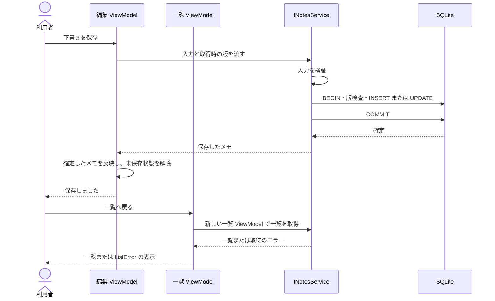

# UCP-1. 取得・編集・確定

関連: [アーキテクチャ](../architecture.md)、[ユースケース](../usecases/メモを作成・編集して保存する/README.md)、[データ設計](data.md)。

適用: 一覧から選んだメモを下書きとして編集し、保存・削除する。

| 役割 | 責務 | 実装パス |
| --- | --- | --- |
| 一覧・編集の対話 | 選択、下書き、入力エラー、未保存確認 | `app/ViewModel/NoteListViewModel.cs`、`NoteEditViewModel.cs` |
| 画面 | 一覧・編集の表示と Binding | `app/View/NoteListView.xaml`、`NoteEditView.xaml` |
| 機能の境界 | 取得・保存・削除の入出力 | `app/Model/Domain/Notes/INotesService.cs` |
| 値の規則 | タイトル・本文の検証 | `app/Model/Domain/Notes/NoteRules.cs` |
| 実処理 | 版検査、SQL、保存確定 | `app/Model/Infrastructure/Sqlite/Notes/NotesService.cs` |
| 永続化基盤 | 接続・初期化・SQL 移行 | `app/Model/Infrastructure/Sqlite/Database.cs` |

下書きの状態更新主体は編集 ViewModel、保存の結果確定点は `NotesService` の COMMIT です。保存処理が返す確定済みのメモを編集画面に反映し、保存完了を表示します。一覧は利用者が一覧画面へ戻ったとき、新しい一覧 ViewModel が取得します。その取得失敗は `ListError` に表示し、以前の保存成功を変更しません。

入力不正・版競合・DB の失敗では下書きを維持し、未確定の書込みを取り消します。削除も取得時の版を検査し、確認を取り消した場合は書き込みません。

実 SQLite の処理は UI スレッドから切り離し、UI の実行中状態で操作を重ねません。モックの差替は [起動時の合成点](../architecture-wpf.md#mock-boundary) で行います。このユースケース固有の逸脱はありません。
