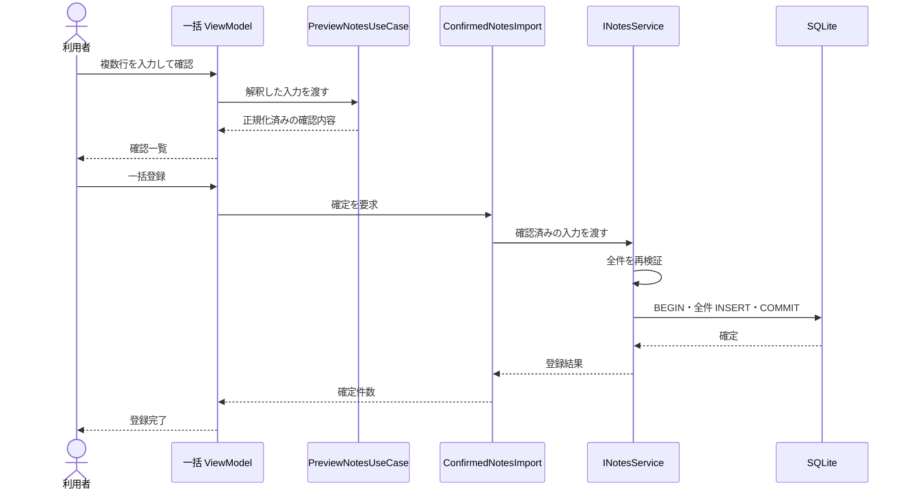

# UCP-2. 入力・確認・一括確定

関連: [アーキテクチャ](../architecture.md)、[ユースケース](../usecases/複数のメモを確認して一括登録する/README.md)、[データ設計](data.md)。

適用: 複数件の入力を正規化して確認し、全件を一体で保存する。

| 役割 | 責務 | 実装パス |
| --- | --- | --- |
| 入力・確認の対話 | 行の解釈、下書き、確認失効、実行中・失敗表示 | `app/ViewModel/ImportNotesViewModel.cs` |
| 画面 | 入力欄と確認一覧 | `app/View/ImportNotesView.xaml` |
| プレビュー | 入力値を検証し、正規化済みの確認内容を作る | `app/Model/UseCase/PreviewNotesUseCase.cs` |
| 確認内容 | 不変の入力を保持し、確定を要求する | `app/Model/UseCase/ConfirmedNotesImport.cs` |
| 一括登録機能 | 再検証、全件 INSERT、COMMIT | `app/Model/Infrastructure/Sqlite/Notes/NotesService.cs` |

対話状態の主体は一括 ViewModel です。プレビューと確認待ちはトランザクション外で行い、入力変更で確認オブジェクトを破棄します。結果確定点は全件 INSERT 後の COMMIT です。途中の保存失敗はロールバックし、下書きと確認内容を維持します。

モックは単票と同じ [INotesService の差替](../architecture-wpf.md#mock-boundary) を使います。件数上限と文字数は [データ設計](data.md) に従い、このユースケース固有の逸脱はありません。
